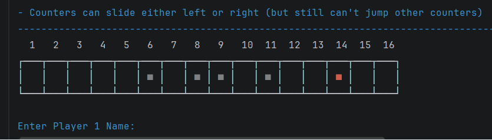
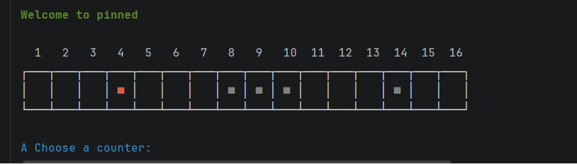
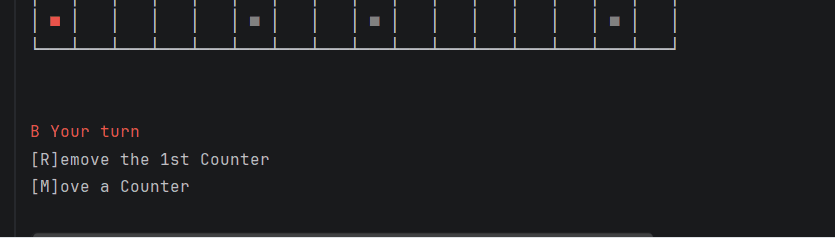
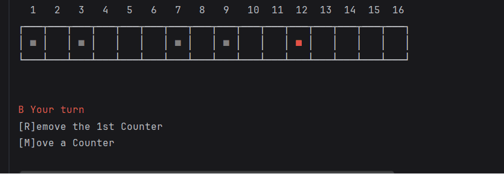

# Results of Testing

The test results show the actual outcome of the testing, following the [Test Plan](test-plan.md)

---

## Test for player names - INVALID
Testing if not entering a name works

### Test Data Used

I will enter an Invalid/Blank value
### Test Result

It worked as expected and did not let me enter a blank value

---

## Moving the counters

testing moving the counters, eg. from 8 - 7
### Test Data Used

I will input valid data that is expected for the code
### Test Result

The counter moved correctly as expected without any issues

---

## Game win

I will test if the players can win
### Test Data Used

I will remove the black counter from square 1
### Test Result

The counter moved correctly as expected

---

## Remove the counter on the first space
Player chooses to remove counter on space 1

### Test Data Used
Player's choice input

### Test Result

The Counter was removed

---

## Game win

### Test Data Used

I will remove the black counter from square 1
### Test Result

The counter moved correctly as expected

---

# Check the checklist, and fix uppercases